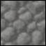
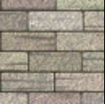

# Simple Texture Synthesis
This is a common texture synthesis based on works of Wey and Levoy.

To compile just type make.

To synthesise, run "./synthesis". To change synthesis options, edit Window.cpp (lines 116-122).

Synthesisng stone texture
<table>
  <tr>
    <td> Input</td>
    <td> Output</td>
  </tr>
  <tr>
    <td>
      
    </td>
    <td>
      
    </td>
  </tr>
</table>

Synthesisng brick texture
<table>
  <tr>
    <td> Input</td>
    <td> Output</td>
  </tr>
  <tr>
    <td>
      
    </td>
    <td>
      
    </td>
  </tr>
</table>
